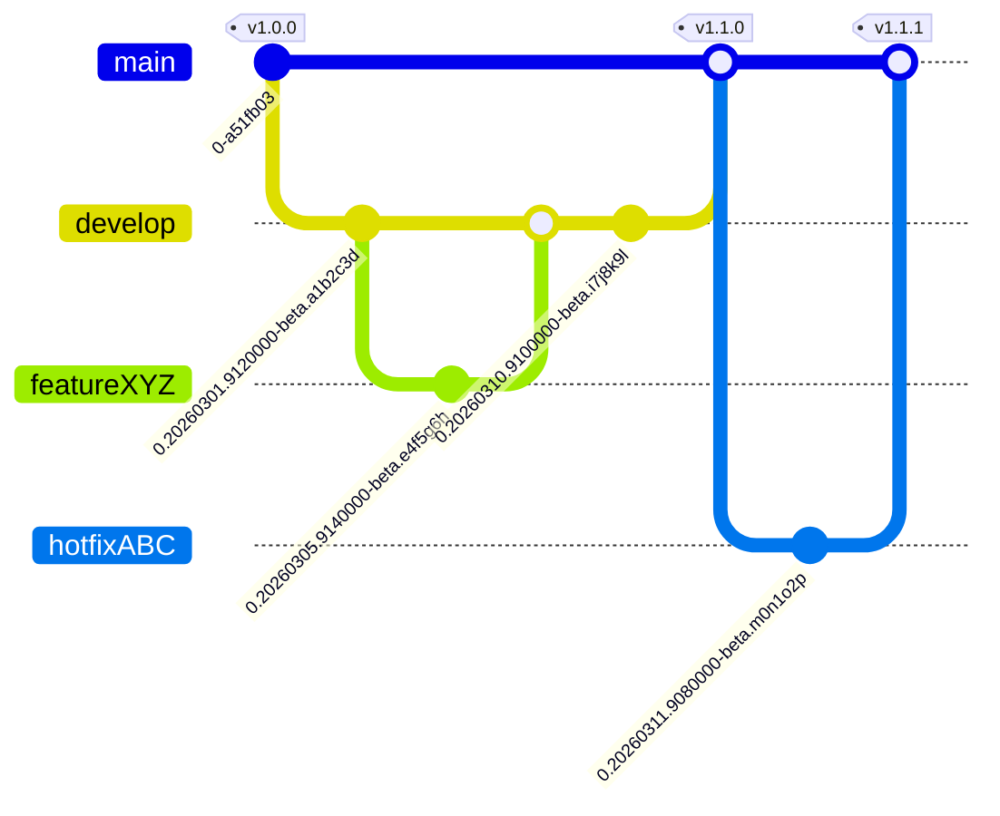

# Branch, Versioning, and Release Strategy

## Branch Strategy



| Branch | Purpose | Merges to |
|--------|---------|-----------|
| `main` | Production-ready code. Only receives fast-forward merges from `develop` or hotfix branches. | - |
| `develop` | Integration branch. All testing happens here. | `main` (ff-only) |
| `feature/*` | Feature work, branched from `develop`. | `develop` |
| `hotfix/*` | Urgent fixes, branched from `main`. | `main` (ff-only) |

Rules:
- Only fast-forward merges to `main` from `develop`
- Feature branches are merged to `develop`
- Hotfixes branch from `main` and merge back to `main`

## Versioning

### Non-release versions (develop, feature, hotfix branches)

Every push triggers a build that generates a version in the format:

```
0.YYYYMMDD.9HHMMSS-beta.<git-short-hash>
```

Example: `0.20260310.9100000-beta.a1b2c3d`

This version is:
- Generated automatically by the CI build pipeline
- Applied to all Maven modules and the Docker image
- Deployed to the **solution** and **verify** environments via ArgoCD

### Release versions (main branch)

When releasing to production, a semver tag is created:

```
v<major>.<minor>.<patch>
```

Example: `v1.7.0`

- **Major**: Breaking changes
- **Minor**: New features or integrations
- **Patch**: Hotfixes

## Release Process

### How it works

1. All development and testing happens on `develop`
2. When ready to release, run the release script (locally or via GitHub Actions)
3. The script fast-forward merges `develop` into `main` and optionally creates a version tag
4. The merge to `main` triggers the build workflow which:
   - Builds the application with Maven
   - Creates a Docker image
   - Pushes the image to GitHub Container Registry (`ghcr.io/wss-ea-ecommerce`)
   - Packages a Helm chart
   - Creates PRs in ArgoCD repositories to deploy the new version

### Option 1: GitHub Actions workflow

1. Go to **Actions** > **Release to Main**
2. Click **Run workflow**
3. Select branch: `develop`
4. Enter version (e.g., `v1.8.0`) or leave empty for merge only
5. Optional: enable **Dry run** to preview
6. Click **Run workflow**

### Option 2: Local script

```bash
git checkout develop
git pull

# Merge only (no tag)
bin/release_to_main.sh

# Merge with tag
bin/release_to_main.sh v1.8.0

# Preview what would happen
bin/release_to_main.sh --dry-run v1.8.0
```

## Deployment

Deployment is managed by **ArgoCD**. The build pipeline automatically creates pull requests in the ArgoCD configuration repositories:

| Environment | ArgoCD Repository | Auto-deployed |
|-------------|-------------------|---------------|
| Solution (SOL) | `k8s-akuity-cl1-sol` | Yes, PR auto-created and merged |
| Verify (VFY) | `k8s-akuity-cl1-vfy` | Yes, PR auto-created and merged |
| Production | `k8s-akuity-cl1-prod` | No, manual edit of `user/cbs-portal-integration.yaml` required |

The deployment artifact is a Docker image built from `portal-integration-consumer/wss-cbslink-portal-integration-consumer-app/Dockerfile_github` and pushed to `ghcr.io/wss-ea-ecommerce`.
