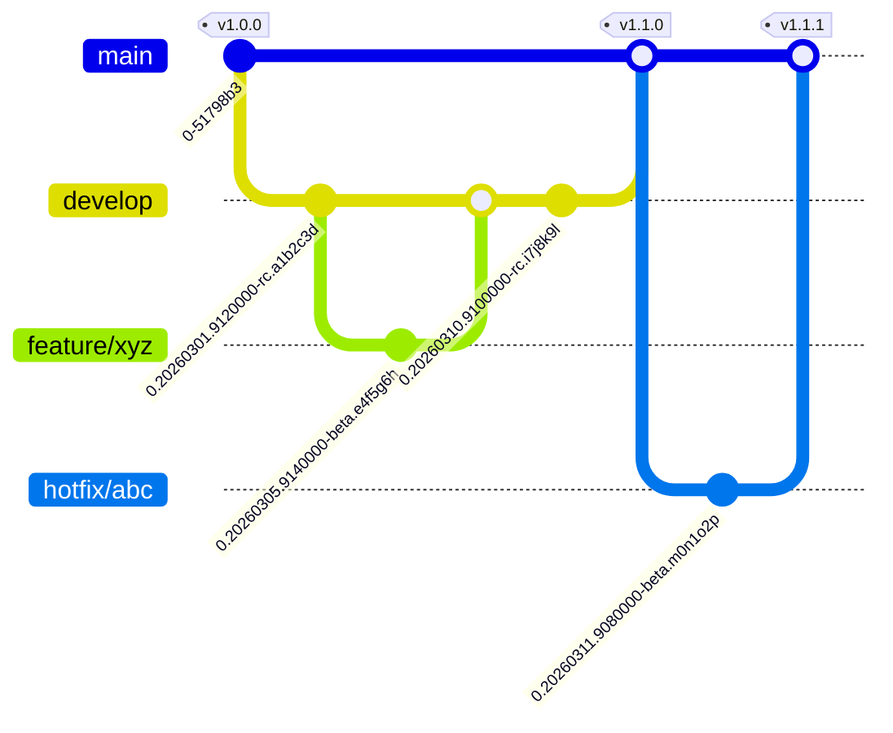

# Branch, Version, and Release

## Branch strategy



| Branch | Purpose | Merges to |
|--------|---------|-----------|
| `main` | Production-ready code. Only fast-forward merges from `develop` or `hotfix/*`. | - |
| `develop` | Integration branch. All testing happens here. | `main` (ff-only) |
| `feature/*` | Feature work, branched from `develop`. | `develop` |
| `hotfix/*` | Urgent fixes, branched from `main`. | `main` (ff-only) |

Only **fast-forward** merges land on `main` — no merge commits. `main` enforces this with a
branch-protection rule (`required_linear_history`), so non-fast-forward pushes are rejected
by GitHub, not just by convention. Inspect or change it with the keyring token (the ambient
`GH_TOKEN`/`GITHUB_TOKEN` cannot read this repo's protection):

```sh
env -u GH_TOKEN -u GITHUB_TOKEN gh api repos/EgneData/egnedata-partnerportal/branches/main/protection
```

## Branch → build-type → version → image

The CI classifies every build from the branch ref / event, and that classification drives
the version string, whether a tag is created, and the image path.

| Branch        | Build type     | Version format                            | Git tag?     | Images pushed? |
|---------------|----------------|-------------------------------------------|--------------|----------------|
| `main`        | `RELEASE`      | `<major>.<minor>.<patch>`                 | Yes `v1.7.0` | yes            |
| `develop`     | `STAGE`        | `0.YYYYMMDD.9HHMMSS-rc.<short-sha>`       | No           | yes            |
| `feature/*`   | `FEATURE`      | `0.YYYYMMDD.9HHMMSS-beta.<short-sha>`     | No           | yes            |
| `hotfix/*`    | `HOTFIX`       | `0.YYYYMMDD.9HHMMSS-beta.<short-sha>`     | No           | yes            |
| pull requests | `PULL_REQUEST` | `0.1.2-SNAPSHOT`                          | No           | no             |
| `dependabot/*`| `DEPENDABOT`   | `0.1.2-SNAPSHOT`                          | No           | no             |
| other         | `OTHER`        | `0.1.2-SNAPSHOT`                          | No           | no             |

Timestamps use `TZ='Europe/Oslo'` (correct DST); the `9` prefixes the time component. The
`stage` pre-release suffix is `-rc.`; `feature`/`hotfix` use `-beta.`.

## Versioning

**Non-release** (`develop`, `feature/*`, `hotfix/*`) versions are timestamped pre-releases:
`0.YYYYMMDD.9HHMMSS-<channel>.<short-sha>`, where the channel is `-rc` for `develop` and
`-beta` for `feature/*`/`hotfix/*`. Example: `0.20260607.9143000-rc.abc1234`.

**Release** versions are computed automatically from commit history by
[`paulhatch/semantic-version`](https://github.com/PaulHatch/semantic-version) — you do not
pick the number. The major/minor/patch increment is derived from the conventional-commit
messages since the last `v*` tag:

- **Major**: breaking changes
- **Minor**: new features or integrations
- **Patch**: fixes

The `v<major>.<minor>.<patch>` tag is created and pushed **by the build pipeline after the
test gate passes** (`tag-release`), not by the release script.

The computed version becomes the **Docker image tag** and the OCI
`org.opencontainers.image.version` label (build-arg `app_version`). Maven artifact versions
in the POMs are independent of it.

## Image paths on ghcr.io

Base: `ghcr.io/egnedata/egnedata-partnerportal/`. Two runtime targets are published per
build: `server` (port 8443) and `intermediate` (port 8444), both from the single root
[`Dockerfile`](../Dockerfile).

| Build type | Image path                                                          | Moving tag |
|------------|---------------------------------------------------------------------|------------|
| `RELEASE`  | `release/{server,intermediate}:<version>`                           | `latest`   |
| `STAGE`    | `stage/{server,intermediate}:<version>`                             | `stage`    |
| `FEATURE`  | `features/<sanitized-branch>-<7hex>/{server,intermediate}:<version>` | none      |
| `HOTFIX`   | `hotfix/<sanitized-branch>-<7hex>/{server,intermediate}:<version>`  | none       |

Branch sanitization: strip the `feature/`/`hotfix/` prefix, lowercase, replace invalid chars
with `-`, collapse runs, trim to ~100 chars, and append a 7-char SHA1 of the full ref for
uniqueness.

Example release ref: `ghcr.io/egnedata/egnedata-partnerportal/release/server:1.7.0`

## Build pipeline (`.github/workflows/build.yml`)

Runs on push to any branch (ignoring `**/*.md`, `docs/**`, `.gitignore`, `.idea/**`), on
pull requests, and via manual dispatch. Jobs:

1. **classify** — determine the build type (table above).
2. **tests**, in parallel — `test-server` (`mvn verify`), `test-intermediate`
   (`mvn -f intermediate/pom.xml verify`), `test-flutter` (`flutter test`), and `test-bats`
   (`bin/start-e2e.sh`, after the two Maven builds).
3. **compute-version** — produce the version string and pending tag.
4. **tag-release** — `RELEASE` builds only; create and push the `v<x.y.z>` tag (idempotent).
5. **publish** — build the `server` and `intermediate` images (matrix) and push them when
   enabled (see [Cutover](#cutover--enabling-image-publishing)).

## Release process

Releases flow `develop` → `main` via **fast-forward merge only**. The merge step does *not*
tag; the build pipeline computes and pushes the tag afterwards. Two equivalent entry points:

**Option 1 — GitHub Actions** ([`release-to-main.yml`](../.github/workflows/release-to-main.yml)):

1. Actions → **Release to Main** → **Run workflow**.
2. Set **Use workflow from** to `develop` (the job only runs on `develop`).
3. Optional: tick **Dry run** to preview the merge without changing anything.
4. The **version** input is *informational only* — echoed in the run summary; it does not set
   the release version (that is computed automatically on `main`).

**Option 2 — local script** ([`bin/release_to_main.sh`](../bin/release_to_main.sh)):

```sh
git checkout develop && git pull

bin/release_to_main.sh --dry-run  # preview, no changes
bin/release_to_main.sh            # interactive, prompts before merging
bin/release_to_main.sh --yes      # non-interactive (skips the prompt)
```

The script must be run from `develop`. It fetches, verifies local `develop` and `main` are
in sync with origin and that a fast-forward is possible, then checks out `main`,
`merge --ff-only develop`, pushes `main`, and returns to `develop`. It takes no version
argument and creates no tag. (Locally you need a `main` branch tracking `origin/main` —
`git branch main origin/main` if you have never checked it out.)

After either entry point pushes to `main`, [`build.yml`](../.github/workflows/build.yml) takes
over: full test gate → `semantic-version` computes the next semver → `tag-release` mints
`v<version>` on the merge commit → `docker-publish` pushes `release/{server,intermediate}:<version>`
and `:latest`.

## Dry run — feature path smoke test

[`bin/ci-dry-run.sh`](../bin/ci-dry-run.sh) pushes a probe commit to a throwaway
`feature/ci-dry-run-<sha>` branch, watches the `build.yml` run, and asserts the publish job
computed the correct `features/<sanitized>-<7hex>/{server,intermediate}` image path — without
writing anything to the registry (`PUBLISH_IMAGES` must be unset/false).

```sh
bash bin/ci-dry-run.sh          # run smoke test, delete remote branch on success
bash bin/ci-dry-run.sh --keep   # leave remote branch for inspection
```

## Cutover — enabling image publishing

Publishing is gated behind a **repository variable**. Until it is set, every `docker-publish`
run builds the images but pushes nothing (`push: false` — a genuine dry run):

```sh
gh variable set PUBLISH_IMAGES --body true
```

That single command is the go-live switch. Once set:

- `RELEASE`, `STAGE`, `FEATURE`, and `HOTFIX` runs push images to ghcr.
- `PULL_REQUEST`, `DEPENDABOT`, and `OTHER` runs never push regardless of the variable.

**First-time visibility**: a newly created ghcr package defaults to private. After the first
push, open the package settings on GitHub and set visibility to public (or leave private if
that is intentional).

## Deployment

This repository's pipeline ends at building (and optionally publishing) the `server` and
`intermediate` images to `ghcr.io`. There is **no deployment automation in this repo** — no
ArgoCD/GitOps PRs, no environment promotion. Deployment of the published images is handled
outside this repository.
